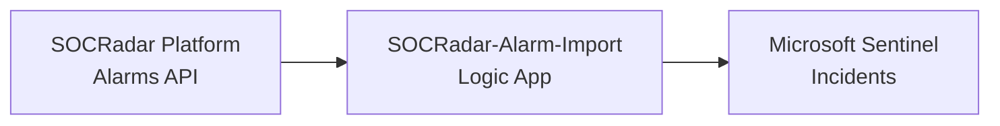
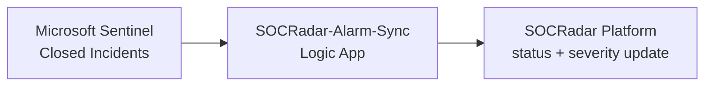

# SOCRadar Alarms for Microsoft Sentinel

Bidirectional integration between SOCRadar XTI Platform and Microsoft Sentinel.

## Architecture

### Alarm Import

Polls SOCRadar on a configurable interval and creates Microsoft Sentinel incidents. Deduplicates by title, tags with SOCRadar + alarm type + subtype. OPEN alarms only by default; you can import all statuses at deploy time.

### Alarm Sync

Watches closed Sentinel incidents tagged SOCRadar. Maps the Sentinel classification to a SOCRadar status, updates SOCRadar, and adds a Synced tag to the incident.

### Analytics

Alarms and audit events can also be written to custom Log Analytics tables, which hunting queries, analytic rules, and the workbook read from. You can toggle audit logging, the alarms table, and the workbook at deploy time.

## Prerequisites

- Microsoft Sentinel workspace
- SOCRadar API key and Company ID

## Parameters

### Required

| Parameter | Description |
|-----------|-------------|
| `WorkspaceName` | Sentinel workspace name (not the GUID) |
| `WorkspaceLocation` | Workspace region (e.g., `northeurope`) |
| `SocradarApiKey` | Your SOCRadar API key |
| `CompanyId` | Your SOCRadar company ID |

### Optional

| Parameter | Default | Description |
|-----------|---------|-------------|
| `WorkspaceResourceGroup` | deployment RG | Set if workspace is in a different RG |
| `SentinelRoleLevel` | `Responder` | `Responder` (least-privilege) or `Contributor` |
| `PollingIntervalMinutes` | `5` | How often to check for alarms (1–60) |
| `InitialLookbackMinutes` | `600` | First-run lookback window (10 hours) |
| `ImportAllStatuses` | `false` | `true` imports RESOLVED / FALSE_POSITIVE / MITIGATED too |
| `EnableAuditLogging` | `true` | Writes audit events to `SOCRadarAuditLog_CL` |
| `EnableAlarmsTable` | `true` | Stores full alarm JSON in `SOCRadar_Alarms_CL` |
| `EnableWorkbook` | `true` | Deploys the SOCRadar Dashboard workbook |
| `TableRetentionDays` | `365` | Retention for custom tables (30–730) |

## What Gets Deployed

- **SOCRadar-Alarm-Import** Logic App — imports alarms as incidents
- **SOCRadar-Alarm-Sync** Logic App — syncs closed incidents back
- **SOCRadar_Alarms_CL** custom table (optional)
- **SOCRadarAuditLog_CL** audit table (optional)
- **SOCRadar Dashboard** workbook (optional)
- Data Collection Endpoint and Rules for custom tables

## Role Selection

Logic Apps use Managed Identity with a Sentinel role:

- **Responder** (default) — create, update, close, classify incidents. Sufficient for this integration.
- **Contributor** — needed only if your environment has automation rules that require elevated access.

## Cross-Region / Cross-RG

- Different region → set `WorkspaceLocation`.
- Different resource group → set `WorkspaceResourceGroup`. Custom tables and workbook must deploy into the workspace RG.

## Post-Deployment

Logic Apps start automatically 3 minutes after deployment (role propagation).

## Support

- **Public Documentation:** [One-Click Deployment Guide](https://github.com/Radargoger/azure-one-click-documentations/blob/main/azureincidents.md)
- **Detailed Documentation (SOCRadar customers):** [Microsoft Azure Sentinel Integration (Bi-Directional)](https://help.socradar.io/hc/en-us/articles/41316851769745-Microsoft-Azure-Sentinel-Integration-Bi-Directional)
- **Support email:** integration@socradar.io
