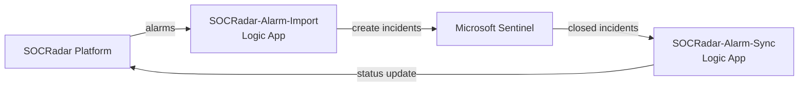

# SOCRadar Alarms for Microsoft Sentinel

Bidirectional integration between SOCRadar XTI Platform and Microsoft Sentinel.

## Architecture

## Prerequisites

- Microsoft Sentinel workspace
- SOCRadar API Key

## Configuration

### Required Parameters

| Parameter | Description |
|-----------|-------------|
| `WorkspaceName` | Your Sentinel workspace name (e.g., `my-sentinel-workspace`, NOT the Workspace ID/GUID) |
| `WorkspaceLocation` | Region of your workspace (e.g., `centralus`, `northeurope`) |
| `SocradarApiKey` | Your SOCRadar API key |
| `CompanyId` | Your SOCRadar company ID |

> **Note:** You can find your Workspace Name in Azure Portal > Log Analytics workspaces > your workspace > Overview > "Name" field.

### Optional Parameters

| Parameter | Type | Default | Description |
|-----------|------|---------|-------------|
| `WorkspaceResourceGroup` | string | *(same as deployment RG)* | Set if your workspace is in a different resource group |
| `SentinelRoleLevel` | dropdown | `Responder` | Sentinel role for Logic Apps. Options: `Responder` (least-privilege, sufficient) or `Contributor` (see [Role Selection](#role-selection)) |
| `PollingIntervalMinutes` | int | `5` | How often to check for new alarms (1-60 min). Lower = more real-time, higher = fewer API calls |
| `InitialLookbackMinutes` | int | `600` | First run lookback in minutes (default 10 hours). Subsequent runs use PollingInterval only |
| `ImportAllStatuses` | bool | `false` | `false` = only OPEN alarms imported (recommended). `true` = imports all statuses including RESOLVED, FALSE_POSITIVE, MITIGATED |
| `EnableAuditLogging` | bool | `true` | `true` = writes Import/Sync/Error events to `SOCRadarAuditLog_CL`. `false` = skips audit writes, no DCR/DCE created |
| `EnableAlarmsTable` | bool | `true` | `true` = stores full alarm JSON in `SOCRadar_Alarms_CL` for analytics and hunting queries. `false` = alarms only become Sentinel incidents |
| `EnableWorkbook` | bool | `true` | `true` = deploys SOCRadar Analytics Dashboard workbook. `false` = no workbook |
| `TableRetentionDays` | int | `365` | Data retention for custom tables (30-730 days). Affects `SOCRadar_Alarms_CL` and `SOCRadarAuditLog_CL` |

## What Gets Deployed

- **SOCRadar-Alarm-Import** - Imports alarms from SOCRadar as Sentinel incidents
- **SOCRadar-Alarm-Sync** - Syncs closed incidents back to SOCRadar
- **SOCRadar_Alarms_CL** - Custom table for alarm analytics (if EnableAlarmsTable=true)
- **SOCRadar Analytics Dashboard** - Workbook with charts and tables (if EnableWorkbook=true)
- **SOCRadarAuditLog_CL** - Audit log table (if EnableAuditLogging=true)
- **Data Collection Endpoint & Rules** - For data ingestion

## Key Features

**Alarm Import**
- Automatically imports SOCRadar alarms as Sentinel incidents
- Severity and status mapping
- Duplicate prevention
- Tags for categorization

**Bidirectional Sync**
- Closed incidents in Sentinel update alarm status in SOCRadar
- Classification mapping: TruePositive to Resolved, FalsePositive to False Positive

**Audit Logging**
- Full alarm JSON stored in Log Analytics
- Query with KQL for reporting

**Analytics Dashboard**
- Severity and status distribution charts
- Alarm timeline visualization
- Top alarm types bar chart
- Recent alarms table

**KQL Queries**
- See `socradar-kql-queries.kql` for 24 ready-to-use queries including:
  - Alarm overview and trends
  - Incident correlation
  - Audit log analysis
  - Alert rules for scheduled analytics

## Role Selection

The template assigns a Sentinel role to Logic App managed identities. Two options are available:

| Role | Permissions | Use Case |
|------|------------|----------|
| **Responder** (default) | Create, update, close, classify incidents | Sufficient for this integration |
| **Contributor** | All Responder permissions + delete incidents, manage analytics rules, settings | Required if your environment has custom automation rules that depend on Contributor-level access |

The default is **Responder**, following the least-privilege principle. If your organization's automation rules or policies require Contributor-level access for integrations, set `SentinelRoleLevel` to `Contributor` during deployment.

## Cross-Region / Cross-Resource-Group

- If your workspace is in a different **region**, set `WorkspaceLocation` to match your workspace region.
- If your workspace is in a different **resource group**, set `WorkspaceResourceGroup`. Custom tables, workbook, and audit logging require same-RG deployment.

## Post-Deployment

Logic Apps are configured to start **3 minutes after deployment** to allow Azure role propagation.

No manual action required - they will start automatically.

## About SOCRadar

SOCRadar is an Extended Threat Intelligence (XTI) platform that provides actionable threat intelligence, digital risk protection, and external attack surface management.

Learn more at [socradar.io](https://socradar.io)

## Support

- **Public Documentation:** [Microsoft Sentinel Integration — One-Click Deployment Guide](https://github.com/Radargoger/azure-one-click-documentations/blob/main/azureincidents.md)
- **Detailed Documentation (SOCRadar customers):** [Microsoft Azure Sentinel Integration (Bi-Directional)](https://help.socradar.io/hc/en-us/articles/41316851769745-Microsoft-Azure-Sentinel-Integration-Bi-Directional)
- **Support:** integration@socradar.io
