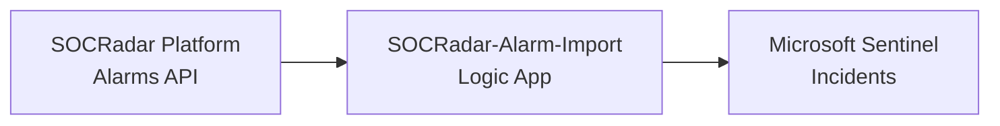
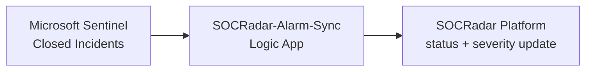
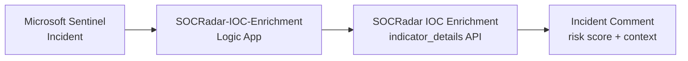

# SOCRadar Alarms for Microsoft Sentinel

Bidirectional integration between SOCRadar and Microsoft Sentinel. Alarms come in as incidents, closed incidents sync back.

## Architecture

### Alarm Import

Pulls alarms from SOCRadar and opens Sentinel incidents. Deduplicates by title, tags with the alarm type/subtype. OPEN only by default.

### Alarm Sync

When you close a SOCRadar-tagged incident in Sentinel, the classification maps back to a SOCRadar status and the alarm is updated.

### Analytics

Alarms and audit events are also written to custom Log Analytics tables. Hunting queries, analytic rules, and the workbook read from them. All three (audit, alarms table, workbook) are toggleable at deploy time.

### IOC Enrichment (optional add-on)

Deployed separately from the main template. When an incident is created, this playbook looks up each related entity (IP, domain, URL, file hash) in **SOCRadar IOC Enrichment** and posts a comment with the risk score, signal strength, categorization, and threat actors.

Deploy `Playbooks/SOCRadar-IOC-Enrichment/azuredeploy.json` on its own:

Notes:

- Uses a dedicated **IOC Enrichment API key** (Standard Licensed APIs entitlement — contact integration@socradar.io).
- `RiskScoreThreshold` (default `0`) — only comments when the score is at or above this value.
- After deployment, create a Microsoft Sentinel **automation rule** (when an incident is created → run this playbook) in the portal.
- Microsoft Sentinel **Responder** role is sufficient.

## Prerequisites

- Microsoft Sentinel workspace
- SOCRadar API key and Company ID

## Parameters

### Required

| Parameter | Description |
|-----------|-------------|
| `WorkspaceName` | Sentinel workspace name (not the GUID) |
| `WorkspaceLocation` | Workspace region (e.g., `northeurope`) |
| `SocradarApiKey` | Your SOCRadar API key |
| `CompanyId` | Your SOCRadar company ID |

### Optional

| Parameter | Default | Description |
|-----------|---------|-------------|
| `WorkspaceResourceGroup` | deployment RG | Set if workspace is in a different RG |
| `SentinelRoleLevel` | `Responder` | `Responder` (least-privilege) or `Contributor` |
| `PollingIntervalMinutes` | `5` | How often to check for alarms (1–60) |
| `InitialLookbackMinutes` | `600` | First-run lookback window (10 hours) |
| `ImportAllStatuses` | `false` | `true` imports RESOLVED / FALSE_POSITIVE / MITIGATED too |
| `EnableAuditLogging` | `true` | Writes audit events to `SOCRadarAuditLog_CL` |
| `EnableAlarmsTable` | `true` | Stores full alarm JSON in `SOCRadar_Alarms_CL` |
| `EnableWorkbook` | `true` | Deploys the SOCRadar Dashboard workbook |
| `TableRetentionDays` | `365` | Retention for custom tables (30–730) |

## What Gets Deployed

- **SOCRadar-Alarm-Import** Logic App — imports alarms as incidents
- **SOCRadar-Alarm-Sync** Logic App — syncs closed incidents back
- **SOCRadar_Alarms_CL** custom table (optional)
- **SOCRadarAuditLog_CL** audit table (optional)
- **SOCRadar Dashboard** workbook (optional)
- Data Collection Endpoint and Rules for custom tables

## Role Selection

Logic Apps run with Managed Identity:

- **Responder** (default) — enough for create / update / close / classify.
- **Contributor** — only if you rely on automation rules that need elevated access.

## Cross-Region / Cross-RG

- Different region → set `WorkspaceLocation`.
- Different resource group → set `WorkspaceResourceGroup`. Custom tables and workbook deploy into the workspace RG.

## Post-Deployment

Logic Apps start 3 minutes after deployment, so role assignments have time to propagate.

## Standalone vs. Microsoft Sentinel Content Hub

This repository is the standalone one-click deployment. It provisions the infrastructure (Data Collection Endpoint, Data Collection Rules, and custom tables) as separate resources alongside the Logic Apps.

The same integration is also available as a Microsoft Sentinel Solution via **Content Hub → SOCRadar**. In that distribution, the infrastructure is provisioned inside the Alarm Import playbook template so it shows up under **Automation → Playbook templates**. Both paths end up with the same workspace state; choose whichever fits your installation workflow.

## Support

- **Public Documentation:** [One-Click Deployment Guide](https://github.com/Radargoger/azure-one-click-documentations/blob/main/azureincidents.md)
- **Detailed Documentation (SOCRadar customers):** [Microsoft Azure Sentinel Integration (Bi-Directional)](https://help.socradar.io/hc/en-us/articles/41316851769745-Microsoft-Azure-Sentinel-Integration-Bi-Directional)
- **Support email:** integration@socradar.io
