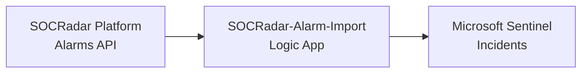
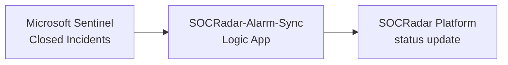

# SOCRadar Alarms for Microsoft Sentinel

Bidirectional integration between SOCRadar and Microsoft Sentinel. Alarms come in as incidents, closed incidents sync back.

[](https://portal.azure.com/#create/Microsoft.Template/uri/https%3A%2F%2Fraw.githubusercontent.com%2Forcunsami%2FSOCRadar-Azure-Incidents%2Fmaster%2Fazuredeploy.json)

## Architecture

### Alarm Import

Pulls alarms from SOCRadar and opens Microsoft Sentinel incidents. Each incident is titled
`[SOCRadar] #<alarm id> - <title>` and labelled with the alarm id, type, subtype and SOCRadar
severity. OPEN alarms only by default. See [Import window and
de-duplication](#import-window-and-de-duplication) for how it picks its window and skips alarms
it has already imported.


```mermaid
flowchart LR
    A["SOCRadar Platform<br/>Alarms API"] --> B["SOCRadar-Alarm-Import<br/>Logic App"]
    B --> C["Microsoft Sentinel<br/>Incidents"]
```

### Alarm Sync

When you close a SOCRadar-labelled incident in Microsoft Sentinel, the classification maps back to a SOCRadar status and the alarm is updated.


```mermaid
flowchart LR
    A["Microsoft Sentinel<br/>Closed Incidents"] --> B["SOCRadar-Alarm-Sync<br/>Logic App"]
    B --> C["SOCRadar Platform<br/>status update"]
```

### Analytics

Alarms and audit events are also written to custom Log Analytics tables. Hunting queries, analytic rules, and the workbook read from them. All three (audit, alarms table, workbook) are toggleable at deploy time.

## Prerequisites

- Microsoft Sentinel workspace -- point `WorkspaceName` at an existing one, or set
  `DeployNewWorkspace=true` to create it as part of this deployment
- SOCRadar API key and Company ID

## Parameters

### Required

| Parameter | Description |
|-----------|-------------|
| `WorkspaceName` | Microsoft Sentinel workspace name (not the GUID) |
| `WorkspaceLocation` | Workspace region (e.g., `northeurope`) |
| `SocradarApiKey` | Your SOCRadar API key |
| `CompanyId` | Your SOCRadar company ID |

A wrong `WorkspaceName` fails the deployment, but not before it has created things. ARM starts
every resource that does not depend on the workspace in parallel, so a typo (measured, with
`DeployNewWorkspace=false`) leaves behind the checkpoint storage account, the Data Collection
Endpoint, the workbook, the Microsoft Sentinel API connection, and an **enabled**
SOCRadar-Alarm-Sync Logic App polling every five minutes. Fix the name and redeploy over the
same resource group, or delete the resource group and start again -- but do not leave the
failed deployment sitting there, because that Logic App is running and billable.

With `DeployNewWorkspace=true` a typo does not fail at all: it creates a second, empty
workspace under the misspelled name.

### Optional

| Parameter | Default | Description |
|-----------|---------|-------------|
| `WorkspaceResourceGroup` | deployment RG | Set if workspace is in a different RG. Changes what gets deployed -- see [Cross-Region / Cross-RG](#cross-region--cross-rg) |
| `DeployNewWorkspace` | `false` | Create `WorkspaceName` instead of using an existing one. The workspace resource states no workspace-level settings, so leaving this `false` against an existing workspace never touches its pricing tier, retention or daily cap -- and setting it `true` by mistake is harmless for the same reason. Ignored when `WorkspaceResourceGroup` is not the deployment RG. |
| `SentinelRoleLevel` | `Responder` | `Responder` (least-privilege) or `Contributor` |
| `PollingIntervalMinutes` | `5` | How often to check for alarms (1-60). Also sets the floor of the import window and the Sync lookback |
| `InitialLookbackMinutes` | `600` | Lookback window when there is no checkpoint yet (10 hours) |
| `ImportAllStatuses` | `false` | `true` imports RESOLVED / FALSE_POSITIVE / MITIGATED too, as already-closed incidents -- see [Importing closed alarms](#importing-closed-alarms) |
| `SyncSeverity` | `false` | Push the Microsoft Sentinel severity back to SOCRadar on close. Off by default because Microsoft Sentinel has no Critical -- see [Severity write-back](#severity-write-back) |
| `EnableIoCEnrichment` | `true` | Attach IP/domain/URL indicators from the alarm to the incident as entities (see [IoC Entity Enrichment](#ioc-entity-enrichment)) |
| `EnableAuditLogging` | `true` | Writes audit events to `SOCRadarAuditLog_CL` |
| `EnableAlarmsTable` | `true` | Stores alarm fields in `SOCRadar_Alarms_CL`. The workbook and four of the five hunting queries need it |
| `EnableWorkbook` | `true` | Deploys the SOCRadar Dashboard workbook. Needs `EnableAlarmsTable=true` -- with the table off, the workbook is skipped even when this is `true` |
| `TableRetentionDays` | `365` | Retention for custom tables (30-730) |

## Existing installations

Deployments made before `DeployNewWorkspace` existed stated a pricing tier on the workspace
resource, and a template overwrites every field it states. If the target workspace was on a
**commitment tier**, that deployment reset it to `PerGB2018` (pay-as-you-go).

Check the current tier:

```bash
az monitor log-analytics workspace show -g <resource-group> -n <workspace> \
  --query "{sku:sku.name, lastSkuUpdate:sku.lastSkuUpdate}" -o json
```

If `lastSkuUpdate` lines up with when you first deployed this integration and the tier isn't
the one you picked, reset your commitment tier from **Log Analytics workspaces > Usage and
estimated costs > Pricing tier**. The current template states no workspace-level settings at
all, so redeploying or upgrading an existing install -- even with `DeployNewWorkspace=true` set
by mistake -- cannot change its pricing tier, retention or daily cap; a mutation test against a
live workspace (non-default 90-day retention, `DeployNewWorkspace=true`) confirmed both the
retention and `sku.lastSkuUpdate` came back untouched after redeploying.

Upgrading also resets the import window once. The checkpoint lives in a storage account named
after the resource group and workspace, so an upgrade in place reuses the same account and keeps
the checkpoint; a deployment into a *different* resource group starts with an empty one and the
first run falls back to `InitialLookbackMinutes`. Either way the de-duplication snapshot stops
that from re-importing anything.

## What Gets Deployed

- **SOCRadar-Alarm-Import** Logic App -- imports alarms as incidents
- **SOCRadar-Alarm-Sync** Logic App -- syncs closed incidents back
- **Checkpoint storage account** -- one Standard_LRS account with a single `ImportState` table
  holding one row per company, so the import knows where it left off. Shared-key access is
  disabled; the Logic App reads and writes it with its own managed identity
- **SOCRadar_Alarms_CL** custom table (optional)
- **SOCRadarAuditLog_CL** audit table (optional)
- **SOCRadar Dashboard** workbook (optional, needs the alarms table)
- **Five hunting queries** under **Microsoft Sentinel > Hunting** (see [Hunting Queries](#hunting-queries))
- Data Collection Endpoint and Rules for custom tables
- **Workspace** -- only when `DeployNewWorkspace=true`, with the subscription default tier
- **Microsoft Sentinel onboarding** -- applied whenever the workspace is in the deployment RG, new or existing
- Role assignments giving each Logic App identity least privilege: Log Analytics Reader,
  Monitoring Metrics Publisher on each DCR, Storage Table Data Contributor on the checkpoint
  account, and the Microsoft Sentinel role from `SentinelRoleLevel`
  (the import identity is raised to Contributor only while `EnableIoCEnrichment=true`)

One deployment installs all of the above. The templates under `Playbooks/` exist for
environments that deploy the pieces separately -- see [below](#deploying-playbooks-separately-not-recommended).

## Incident Labels

Every imported incident carries these labels. Sync and the hunting queries read them, so they
are a contract, not decoration.

| Label | Example | Purpose |
|---|---|---|
| `SOCRadar` | `SOCRadar` | Marks the incident as ours. Sync only looks at incidents that have it |
| `SOCRadar-Alarm-<id>` | `SOCRadar-Alarm-104658646` | The machine-readable alarm id Sync writes back against |
| alarm main type | `Domain` | From `alarm_type_details.alarm_main_type` |
| alarm sub type | `Impersonating Domain` | From `alarm_type_details.alarm_sub_type`, when the alarm has one |
| `SOCRadar-Severity-<LEVEL>` | `SOCRadar-Severity-CRITICAL` | The SOCRadar severity, which is what stops [Severity write-back](#severity-write-back) from lowering it |

Incidents imported as already closed carry a sixth label, `Synced` -- see
[Importing closed alarms](#importing-closed-alarms).

Sync reads the alarm id from `SOCRadar-Alarm-<id>` and falls back to parsing it out of the
incident title, so incidents created before these labels existed still sync. The obvious field
for this, `providerIncidentId`, cannot be used: Azure overwrites both it and `providerName` on
any incident created through the API, silently and without an error.

## Import window and de-duplication

**The window** decides how far back to ask SOCRadar for alarms. It comes from a checkpoint row
in the deployed storage table (`PartitionKey` = your company id, `RowKey` = `import`), stamped
with the time the run *started*:

- No row yet -- first run, or a deployment into a new resource group -- falls back to
  `InitialLookbackMinutes` (600).
- Otherwise the gap since the last successful run, plus 15 minutes of overlap, with a floor of
  `max(PollingIntervalMinutes x 6, 60)` minutes and a ceiling of 7 days.
- The row is written only after the run has read every page. A run that dies halfway leaves the
  window where it was, so nothing is skipped.
- On a fresh deployment the first write can fail while the role assignment propagates. That is
  recorded in the run history and is not fatal: the window stays on the fallback and the next
  run writes the row.
- Cost is negligible -- a handful of rows a day in a Standard_LRS table.

**De-duplication** decides whether an alarm already has an incident. Before importing, the run
lists every `[SOCRadar]`-titled incident in the workspace and skips any alarm whose id is
already there, which is what makes a widened window harmless.

Earlier versions derived the window from the newest existing incident's title. That coupled the
window to the incident list, so a workspace whose incidents had been cleaned up would re-import
from scratch.

## Importing closed alarms

With `ImportAllStatuses=false` (default) only OPEN alarms are imported, as active incidents
through the Microsoft Sentinel connector.

With `ImportAllStatuses=true` every other status is imported too, as an incident that is created
already closed with the classification mapped from the alarm status:

| SOCRadar status | Microsoft Sentinel classification | Classification reason |
|---|---|---|
| `FALSE_POSITIVE` | `FalsePositive` | `InaccurateData` |
| `MITIGATED` | `BenignPositive` | `SuspiciousButExpected` |
| `RESOLVED` | `TruePositive` | `SuspiciousActivity` |
| anything else (e.g. `INVESTIGATING`) | `Undetermined` | none |

These incidents are labelled `Synced` at creation so Sync leaves them alone. Without that label
Sync would treat them as analyst closures and write a status back for a closure SOCRadar itself
reported -- and an alarm that landed on `Undetermined` would come back as `RESOLVED`.

## Severity write-back

Closing an incident always writes the mapped status back to SOCRadar. The **severity** is a
separate, opt-in write, governed by `SyncSeverity` (default `false`).

It is off by default because the two scales do not line up: Microsoft Sentinel's highest
severity is High, SOCRadar's is CRITICAL. Closing a CRITICAL alarm in Microsoft Sentinel used to
push High back and permanently lower the alarm, with no way to undo it.

With `SyncSeverity=true` the write can only ever raise a severity:

| SOCRadar alarm | Incident closed as | Written back |
|---|---|---|
| CRITICAL | High / Medium / Low | no -- never lowered |
| HIGH | Medium / Low | no |
| HIGH | High | no -- already equal |
| MEDIUM | High | yes |
| LOW | Medium / High | yes |
| INFO | Low / Medium / High | yes |
| any | Informational | no -- never written back |
| unrecognised severity label | anything | no -- the incident is left alone |

Five levels are recognised: CRITICAL, HIGH, MEDIUM, LOW and INFO. INFO matters more than its
name suggests -- it was 20 of the 35 alarms in the last seven days of the test feed, so an INFO
alarm has to be raisable or the feature does nothing for most of the queue. Any level outside
those five still lands on the incident as a label but carries no rank, so the write-back skips
that incident rather than guessing.

Note that on the way in, an INFO alarm becomes a **Low** incident: the import maps CRITICAL and
HIGH to High, MEDIUM to Medium, and everything else to Low. Microsoft Sentinel's Informational
is not used.

The status mapping in the other direction is fixed:

| Microsoft Sentinel classification | SOCRadar status |
|---|---|
| `FalsePositive` | `9` FALSE_POSITIVE |
| `BenignPositive` | `12` MITIGATED |
| `TruePositive` | `2` RESOLVED |
| `Undetermined` | `2` RESOLVED |

## IoC Entity Enrichment

Microsoft Sentinel's incident API accepts no entities directly, so an incident's **Entities** tab
is fed only by alerts and bookmarks. With `EnableIoCEnrichment` (default `true`), the import
playbook extracts IPv4/domain/URL indicators from the alarm, writes them to a bookmark with
entity mappings, and relates that bookmark to the incident.

- Up to 100 deduplicated indicators per incident; hashes are not extracted; `socradar.com` and
  filename-like values are excluded.
- Bookmark write needs **Microsoft Sentinel Contributor**, which Responder does not include --
  the import playbook's identity is raised to Contributor only while this is `true`.
- Entities can take a few minutes to appear after the incident is created.
- Enrichment failures never block the import -- the incident and audit log are unaffected.

Set `EnableIoCEnrichment=false` to keep the import identity on `SentinelRoleLevel` (Responder).

## Role Selection

Logic Apps run with Managed Identity:

- **Responder** (default) -- enough for create / update / close / classify.
- **Contributor** -- only if you rely on automation rules that need elevated access.

`SentinelRoleLevel` does not apply to the import identity while `EnableIoCEnrichment` is true --
see [IoC Entity Enrichment](#ioc-entity-enrichment).

## Deploying Playbooks Separately (not recommended)

Use the one-click template above for new installs. The templates under `Playbooks/` are kept
for existing separated deployments:

- The standalone Import playbook has the same IoC entity enrichment as the combined template
  (`EnableIoCEnrichment`, default `true`) -- see [IoC Entity Enrichment](#ioc-entity-enrichment).
  Its identity is raised to Contributor the same way. Set `EnableIoCEnrichment=false` if you
  want it to stay on `SentinelRoleLevel`.
- It deploys its own checkpoint storage account. The name is derived from the resource group
  and the workspace, so an import playbook deployed into the same resource group as a combined
  install shares that install's account and checkpoint row; deployed into another resource
  group it keeps its own.
- If you enable the custom tables but leave `AlarmsDcrResourceId` / `AuditDcrResourceId` empty,
  the deployment still succeeds while every ingestion call returns 403 and the tables stay
  silently empty.

If you still deploy them separately, deploy the infrastructure templates first and pass their
DCR resource ID outputs into the import playbook:

```bash
az deployment group create -g <resource-group> \
  --template-file Playbooks/SOCRadar-Alarms-Infrastructure/azuredeploy.json \
  --parameters WorkspaceName=<workspace> WorkspaceLocation=<region>
# take alarmsDcrId from the deployment output

az deployment group create -g <resource-group> \
  --template-file Playbooks/SOCRadar-Alarm-Import/azuredeploy.json \
  --parameters WorkspaceName=<workspace> SocradarApiKey=<key> CompanyId=<id> \
               EnableAlarmsTable=true DceEndpoint=<dceEndpoint> \
               AlarmsDcrImmutableId=<alarmsDcrImmutableId> AlarmsDcrResourceId=<alarmsDcrId>
```

`tools/check_template_drift.py` compares these standalone templates against `azuredeploy.json`
on every push and PR so they cannot silently fall behind.

## Hunting Queries

Five queries are deployed with the integration and appear under **Microsoft Sentinel >
Hunting**. Nothing to import.

| Query | Reads | Needs |
|---|---|---|
| SOCRadar Alarm Overview | `SOCRadar_Alarms_CL` | `EnableAlarmsTable=true` |
| SOCRadar Critical Alarms | `SOCRadar_Alarms_CL` | `EnableAlarmsTable=true` |
| SOCRadar Alarm Trends | `SOCRadar_Alarms_CL` | `EnableAlarmsTable=true` |
| SOCRadar Incident Correlation | `SecurityIncident` | nothing -- always deployed |
| SOCRadar Audit Analysis | `SOCRadarAuditLog_CL` | `EnableAuditLogging=true` |

The custom tables keep a fixed column list, so a query naming a column outside it would return
nothing forever without failing. `tests/test_hunting_queries.py` checks every column each query
reads against the tables the deployment actually creates.

`socradar-kql-queries.kql` holds these and other queries as plain KQL, for pasting into Logs.

## Analytic Rules

Three scheduled rules ship in `Analytic Rules/` as YAML. They are not created by the
deployment -- import them once the custom tables have data: **Microsoft Sentinel > Analytics >
Import**, then select the files. The first two need `EnableAlarmsTable=true`.

| Rule | Fires when |
|---|---|
| `SOCRadarCriticalAlarmDetection.yaml` | An open alarm arrives with HIGH or CRITICAL severity |
| `SOCRadarAlarmVolumeSpike.yaml` | Hourly alarm count for a type exceeds 3x its 7-day average |
| `SOCRadarUnsyncedClosedIncident.yaml` | A closed SOCRadar incident still has no Synced label after 30 minutes |

## Cross-Region / Cross-RG

- Different region -> set `WorkspaceLocation` to the workspace's own region. A workspace's
  region is independent of its resource group's region, so read it from the workspace
  Overview blade instead of assuming they match -- the parameter defaults to the resource
  group's region, which is wrong whenever they differ. Deploying with the wrong value fails with:

  ```
  LinkedResourceNotFound: Linked Workspace '/subscriptions/.../workspaces/<name>'
  was not found in location '<region>'
  ```

  If the workspace name is correct, the region is the cause: set `WorkspaceLocation` to the
  workspace's region and redeploy -- the message names the resource, not the actual cause.
  (The template cannot read the region off the workspace for you: ARM rejects the
  `reference()` function in a resource's `location` field.)
- Different resource group -> set `WorkspaceResourceGroup`. This deploys **incident import and
  sync only**. Both Logic Apps, the Microsoft Sentinel connection and the checkpoint storage
  account go into the deployment RG, and the role assignments the identities need go into the
  workspace RG. Everything analytics-related is skipped, in both resource groups: the custom
  tables, the Data Collection Endpoint and Rules, the workbook and all five hunting queries.
  `EnableAuditLogging` and `EnableAlarmsTable` are forced off inside the import Logic App to
  match, so nothing tries to ingest into a table that was never created -- you get no silent 403s, and no
  analytics. The Microsoft Sentinel onboarding state is also skipped, so the workspace must
  already be onboarded.
- `DeployNewWorkspace` only works in the deployment resource group -- a workspace cannot be
  created in another RG from this template.

## Post-Deployment

Logic Apps start 3 minutes after deployment, so role assignments have time to propagate.

## Removing the integration

Deleting the resource group removes everything, including the checkpoint storage account. If you
delete resources individually, remember the storage account -- it is the one resource whose name
is derived rather than fixed:

```bash
az storage account list -g <resource-group> --query "[?starts_with(name,'srinc')].name" -o tsv
```

If the workspace is in **another** resource group, deleting the integration resource group leaves
the two role assignments behind at workspace scope with no principal to grant. Azure keeps them,
and a later install from a different resource group then fails with
`RoleAssignmentUpdateNotPermitted` -- the assignment name is derived from the workspace, the
playbook name and the role, so the new identity collides with the orphan. That deployment failure
is not a clean rollback either: the Logic Apps, storage account and API connections it created
before the role step are left enabled. Remove the orphans first, or reuse the original resource
group name:

```bash
az role assignment list --scope <workspace-resource-id> \
  --query "[?principalName==null].{name:name,role:roleDefinitionName}" -o table
az role assignment delete --ids <id>
```

## Standalone vs. Microsoft Sentinel Content Hub

This repository is the standalone one-click deployment. It provisions the infrastructure (Data Collection Endpoint, Data Collection Rules, and custom tables) as separate resources alongside the Logic Apps.

The same integration is also available as a Microsoft Sentinel Solution via **Content Hub -> SOCRadar**. In that distribution, the infrastructure is provisioned inside the Alarm Import playbook template so it shows up under **Automation -> Playbook templates**. Both paths end up with the same workspace state; choose whichever fits your installation workflow.

## Support

- **Public Documentation:** [One-Click Deployment Guide](https://github.com/Radargoger/azure-one-click-documentations/blob/main/azureincidents.md)
- **Detailed Documentation (SOCRadar customers):** [Microsoft Azure Sentinel Integration (Bi-Directional)](https://help.socradar.io/hc/en-us/articles/41316851769745-Microsoft-Azure-Sentinel-Integration-Bi-Directional)
- **Support email:** integration@socradar.io
