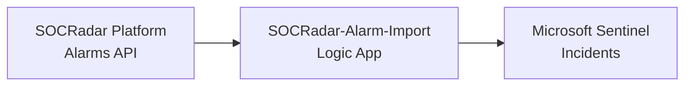
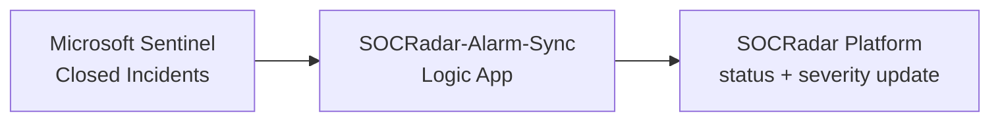

# SOCRadar Alarms for Microsoft Sentinel

Bidirectional integration between SOCRadar and Microsoft Sentinel. Alarms come in as incidents, closed incidents sync back.

[](https://portal.azure.com/#create/Microsoft.Template/uri/https%3A%2F%2Fraw.githubusercontent.com%2Forcunsami%2FSOCRadar-Azure-Incidents%2Fmaster%2Fazuredeploy.json)

## Architecture

### Alarm Import

Pulls alarms from SOCRadar and opens Sentinel incidents. Deduplicates by title, tags with the alarm type/subtype. OPEN only by default.


```mermaid
flowchart LR
    A["SOCRadar Platform<br/>Alarms API"] --> B["SOCRadar-Alarm-Import<br/>Logic App"]
    B --> C["Microsoft Sentinel<br/>Incidents"]
```

### Alarm Sync

When you close a SOCRadar-tagged incident in Sentinel, the classification maps back to a SOCRadar status and the alarm is updated.


```mermaid
flowchart LR
    A["Microsoft Sentinel<br/>Closed Incidents"] --> B["SOCRadar-Alarm-Sync<br/>Logic App"]
    B --> C["SOCRadar Platform<br/>status + severity update"]
```

### Analytics

Alarms and audit events are also written to custom Log Analytics tables. Hunting queries, analytic rules, and the workbook read from them. All three (audit, alarms table, workbook) are toggleable at deploy time.

## Prerequisites

- Microsoft Sentinel workspace -- point `WorkspaceName` at an existing one, or set
  `DeployNewWorkspace=true` to create it as part of this deployment
- SOCRadar API key and Company ID

## Parameters

### Required

| Parameter | Description |
|-----------|-------------|
| `WorkspaceName` | Sentinel workspace name (not the GUID) |
| `WorkspaceLocation` | Workspace region (e.g., `northeurope`) |
| `SocradarApiKey` | Your SOCRadar API key |
| `CompanyId` | Your SOCRadar company ID |

### Optional

| Parameter | Default | Description |
|-----------|---------|-------------|
| `WorkspaceResourceGroup` | deployment RG | Set if workspace is in a different RG |
| `DeployNewWorkspace` | `false` | Create `WorkspaceName` instead of using an existing one. The workspace resource states no workspace-level settings, so leaving this `false` against an existing workspace never touches its pricing tier, retention or daily cap -- and setting it `true` by mistake is harmless for the same reason. Ignored when `WorkspaceResourceGroup` is not the deployment RG. |
| `SentinelRoleLevel` | `Responder` | `Responder` (least-privilege) or `Contributor` |
| `PollingIntervalMinutes` | `5` | How often to check for alarms (1-60) |
| `InitialLookbackMinutes` | `600` | First-run lookback window (10 hours) |
| `ImportAllStatuses` | `false` | `true` imports RESOLVED / FALSE_POSITIVE / MITIGATED too |
| `EnableIoCEnrichment` | `true` | Attach IP/domain/URL indicators from the alarm to the incident as entities (see [IoC Entity Enrichment](#ioc-entity-enrichment)) |
| `EnableAuditLogging` | `true` | Writes audit events to `SOCRadarAuditLog_CL` |
| `EnableAlarmsTable` | `true` | Stores full alarm JSON in `SOCRadar_Alarms_CL` |
| `EnableWorkbook` | `true` | Deploys the SOCRadar Dashboard workbook |
| `TableRetentionDays` | `365` | Retention for custom tables (30-730) |

## Existing installations

Deployments made before `DeployNewWorkspace` existed stated a pricing tier on the workspace
resource, and a template overwrites every field it states. If the target workspace was on a
**commitment tier**, that deployment reset it to `PerGB2018` (pay-as-you-go).

Check the current tier:

```bash
az monitor log-analytics workspace show -g <resource-group> -n <workspace> \
  --query "{sku:sku.name, lastSkuUpdate:sku.lastSkuUpdate}" -o json
```

If `lastSkuUpdate` lines up with when you first deployed this integration and the tier isn't
the one you picked, reset your commitment tier from **Log Analytics workspaces > Usage and
estimated costs > Pricing tier**. The current template states no workspace-level settings at
all, so redeploying or upgrading an existing install -- even with `DeployNewWorkspace=true` set
by mistake -- cannot change its pricing tier, retention or daily cap; a mutation test against a
live workspace (non-default 90-day retention, `DeployNewWorkspace=true`) confirmed both the
retention and `sku.lastSkuUpdate` came back untouched after redeploying.

## What Gets Deployed

- **SOCRadar-Alarm-Import** Logic App -- imports alarms as incidents
- **SOCRadar-Alarm-Sync** Logic App -- syncs closed incidents back
- **SOCRadar_Alarms_CL** custom table (optional)
- **SOCRadarAuditLog_CL** audit table (optional)
- **SOCRadar Dashboard** workbook (optional)
- Data Collection Endpoint and Rules for custom tables
- **Workspace** -- only when `DeployNewWorkspace=true`, with the subscription default tier
- **Sentinel onboarding** -- applied whenever the workspace is in the deployment RG, new or existing
- Role assignments giving each Logic App identity least privilege: Log Analytics Reader,
  Monitoring Metrics Publisher on each DCR, and the Sentinel role from `SentinelRoleLevel`
  (the import identity is raised to Contributor only while `EnableIoCEnrichment=true`)

One deployment installs all of the above. The templates under `Playbooks/` exist for
environments that deploy the pieces separately -- see [below](#deploying-playbooks-separately-not-recommended).

## IoC Entity Enrichment

Sentinel's incident API accepts no entities directly, so an incident's **Entities** tab is fed
only by alerts and bookmarks. With `EnableIoCEnrichment` (default `true`), the import playbook
extracts IPv4/domain/URL indicators from the alarm, writes them to a bookmark with entity
mappings, and relates that bookmark to the incident.

- Up to 100 deduplicated indicators per incident; hashes are not extracted; `socradar.com` and
  filename-like values are excluded.
- Bookmark write needs **Microsoft Sentinel Contributor**, which Responder does not include --
  the import playbook's identity is raised to Contributor only while this is `true`.
- Entities can take a few minutes to appear after the incident is created.
- Enrichment failures never block the import -- the incident and audit log are unaffected.

Set `EnableIoCEnrichment=false` to keep the import identity on `SentinelRoleLevel` (Responder).

## Role Selection

Logic Apps run with Managed Identity:

- **Responder** (default) -- enough for create / update / close / classify.
- **Contributor** -- only if you rely on automation rules that need elevated access.

`SentinelRoleLevel` does not apply to the import identity while `EnableIoCEnrichment` is true --
see [IoC Entity Enrichment](#ioc-entity-enrichment).

## Deploying Playbooks Separately (not recommended)

Use the one-click template above for new installs. The templates under `Playbooks/` are kept
for existing separated deployments:

- The standalone Import playbook has the same IoC entity enrichment as the combined template
  (`EnableIoCEnrichment`, default `true`) -- see [IoC Entity Enrichment](#ioc-entity-enrichment).
  Its identity is raised to Contributor the same way. Set `EnableIoCEnrichment=false` if you
  want it to stay on `SentinelRoleLevel`.
- If you enable the custom tables but leave `AlarmsDcrResourceId` / `AuditDcrResourceId` empty,
  the deployment still succeeds while every ingestion call returns 403 and the tables stay
  silently empty.

If you still deploy them separately, deploy the infrastructure templates first and pass their
DCR resource ID outputs into the import playbook:

```bash
az deployment group create -g <resource-group> \
  --template-file Playbooks/SOCRadar-Alarms-Infrastructure/azuredeploy.json \
  --parameters WorkspaceName=<workspace> WorkspaceLocation=<region>
# take alarmsDcrId from the deployment output

az deployment group create -g <resource-group> \
  --template-file Playbooks/SOCRadar-Alarm-Import/azuredeploy.json \
  --parameters WorkspaceName=<workspace> SocradarApiKey=<key> CompanyId=<id> \
               EnableAlarmsTable=true DceEndpoint=<dceEndpoint> \
               AlarmsDcrImmutableId=<alarmsDcrImmutableId> AlarmsDcrResourceId=<alarmsDcrId>
```

`tools/check_template_drift.py` compares these standalone templates against `azuredeploy.json`
on every push and PR so they cannot silently fall behind.

## Analytic Rules

Three scheduled rules ship in `Analytic Rules/` as YAML. They are not created by the
deployment -- import them once the custom tables have data: **Microsoft Sentinel > Analytics >
Import**, then select the files. The first two need `EnableAlarmsTable=true`.

| Rule | Fires when |
|---|---|
| `SOCRadarCriticalAlarmDetection.yaml` | An open alarm arrives with HIGH or CRITICAL severity |
| `SOCRadarAlarmVolumeSpike.yaml` | Hourly alarm count for a type exceeds 3x its 7-day average |
| `SOCRadarUnsyncedClosedIncident.yaml` | A closed SOCRadar incident still has no Synced tag after 30 minutes |

## Cross-Region / Cross-RG

- Different region -> set `WorkspaceLocation`.
- Different resource group -> set `WorkspaceResourceGroup`. Custom tables and workbook deploy into the workspace RG.
- `DeployNewWorkspace` only works in the deployment resource group -- a workspace cannot be created in another RG from this template.

## Post-Deployment

Logic Apps start 3 minutes after deployment, so role assignments have time to propagate.

## Standalone vs. Microsoft Sentinel Content Hub

This repository is the standalone one-click deployment. It provisions the infrastructure (Data Collection Endpoint, Data Collection Rules, and custom tables) as separate resources alongside the Logic Apps.

The same integration is also available as a Microsoft Sentinel Solution via **Content Hub -> SOCRadar**. In that distribution, the infrastructure is provisioned inside the Alarm Import playbook template so it shows up under **Automation -> Playbook templates**. Both paths end up with the same workspace state; choose whichever fits your installation workflow.

## Support

- **Public Documentation:** [One-Click Deployment Guide](https://github.com/Radargoger/azure-one-click-documentations/blob/main/azureincidents.md)
- **Detailed Documentation (SOCRadar customers):** [Microsoft Azure Sentinel Integration (Bi-Directional)](https://help.socradar.io/hc/en-us/articles/41316851769745-Microsoft-Azure-Sentinel-Integration-Bi-Directional)
- **Support email:** integration@socradar.io
